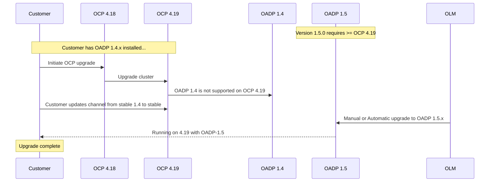

# OADP Partner Information

## Important Announcement: Version Support Changes
Starting in 2025, OADP will implement a streamlined version support policy. 
Red Hat will support only one version of OADP per OpenShift version to ensure 
better stability and maintainability.

## Version Mapping

### Current and Planned Supported Versions
| OpenShift Version | OADP Version | Velero Version | Estimated Release Timeline [1]|
|-------------------|--------------|----------------|-------------------------------|
| 4.14              | 1.3, 1.4     | v1.12, v1.14   | released                      |
| 4.15              | 1.3, 1.4     | v1.12, v1.14   | released                      |
| 4.16              | 1.4          | v1.14          | released                      | 
| 4.17              | 1.4          | v1.14          | released                      |
| 4.18              | 1.4          | v1.14          | released                      |
| 4.19              | 1.5          | v1.16          | Q2 2025                       |
| 4.20              | 1.5          | v1.16          | Q4 2025                       |
| 4.21              | 1.6          | v1.18          | Q1 2026                       |

### OADP Plugins of interest
| OpenShift Version | OADP Version | Velero Version | kubevirt-velero-plugin | hypershift-oadp-plugin   | channel               |
| ----------------- | ------------ | -------------- | ---------------------- | ------------------------ |---------------------- |
|  4.14             | 1.3, 1.4     | v1.12, v1.14   | v0.6, v0.7             | n/a                      | stable-1.3, stable-1.4|
|  4.15             | 1.3, 1.4     | v1.12, v1.14   | v0.6, v0.7             | n/a                      | stable-1.3, stable-1.4|
|  4.16             | 1.4          | v1.14          | v0.7                   | n/a                      | stable-1.4            |
|  4.17             | 1.4          | v1.14          | v0.7                   | n/a                      | stable-1.4            |
|  4.18             | 1.4          | v1.14          | v0.7                   | n/a                      | stable-1.4            |
|  4.19             | 1.5          | v1.16          | v0.8                   | oadp-1.5                 | stable                |
|  4.20             | 1.5          | v1.16          | v0.8                   | oadp-1.5                 | stable                |
|  4.21             | 1.6          | v1.18          | v0.9                   | oadp-1.6                 | stable                |

* [1] Release timelines are estimates,and versions are subject to change.

## Impact on Partners
- Partners must align their integration testing with the specific OADP version corresponding 
to their target OpenShift version
    - Unreleased OADP builds are available via the branches of this oadp-operator 
    repository.  The next release will be available for install via the `master` 
    branch until such time the next release branch is created, the `oadp-1.<version>+1` 
    branch will be made available for install.
     - latest branched version is [oadp-1.4](https://github.com/openshift/oadp-operator/tree/oadp-1.4)

## Action Items for Partners
1. Update your test matrices to reflect the new version pairing strategy
2. Determine if installing development builds from the openshift git repository is acceptable for testing and certification efforts.  If a downstream build is required, please contact your Red Hat partner manager for guidance.
3. Update documentation to reflect supported version combinations
4. Communicate these changes to customers using your backup solutions

## Additional Resources
- [Red Hat Partner Program](https://connect.redhat.com/)
- [Contact Red Hat Support](https://access.redhat.com/support)

## Upgrade workflow
### Automatic upgrade: 

Automatic upgrades are expected to be available in OADP 1.6.0 once OADP can move from sqllite catalogs to [file based catalogs](https://olm.operatorframework.io/docs/reference/file-based-catalogs/).

### Customer upgrades to OCP 4.19 while on OADP's stable-1.4 channel

---
## Upstream k8s / velero news to follow
* https://hackmd.io/bxrvgewUQ5ORH10BKUFpxw#Discussion-Topics
* https://kubernetes.io/blog/2024/07/19/kubernetes-1-31-upcoming-changes/#removal-of-all-in-tree-integrations-with-cloud-providers
* https://kubernetes.io/docs/concepts/storage/volumes/

---
Last Updated: May 2025

Note: Release timelines are subject to change.
