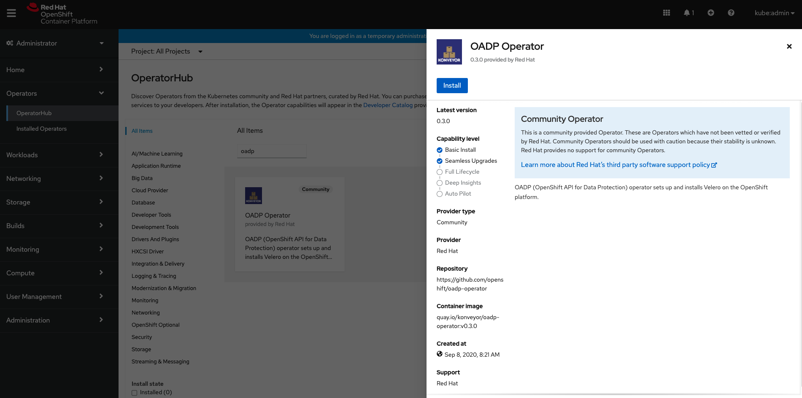
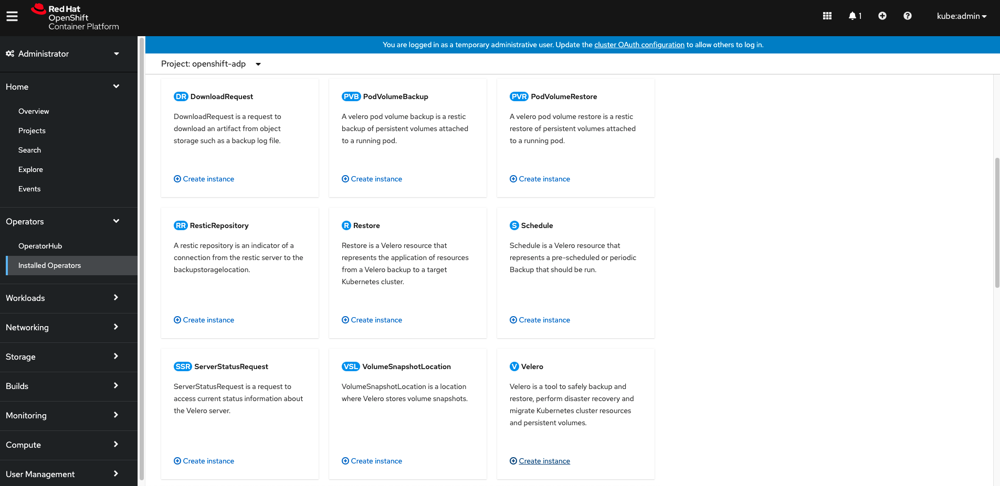
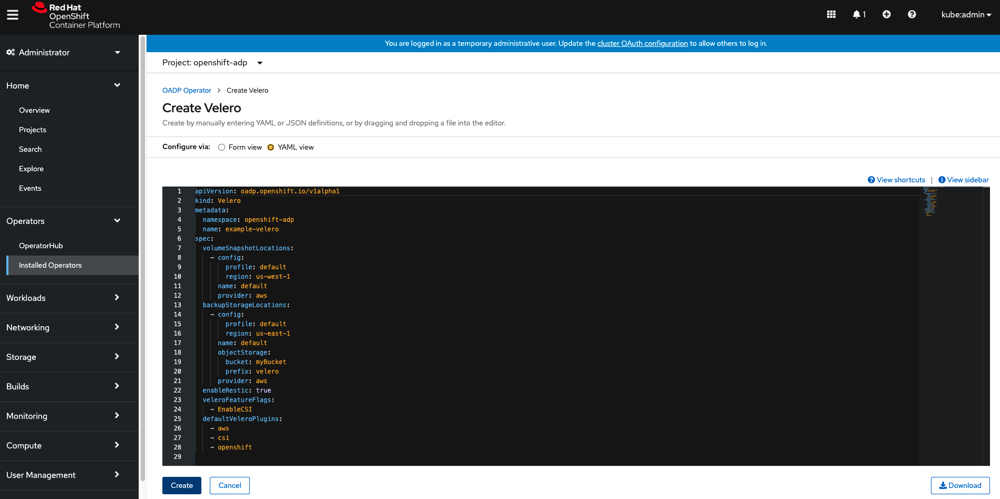

# OADP Operator

## Overview

OADP is OpenShift API for Data Protection operator. This operator sets up and installs [Velero](https://velero.io/) on the OpenShift platform.

## Presentations
* YouTube: [OpenShift Commons AMA: OpenShift API Data Protection (OADP) with Ceph CSI](https://www.youtube.com/watch?v=cyal8B3czLg)

## Prerequisites

- Docker/Podman
- OpenShift CLI
- Access to OpenShift cluster


***
## Getting started with basic install (OLM/OperatorHub)
***


### Installing Operator

You can install the OADP Operator from the Openshift's OperatorHub. You can search for the operator using keywords like `oadp` or `velero`


Now click on Install



Finally, click on subscribe, this will create a namespace named `oadp-operator` if it does not exist and install the OADP operator in it.


### Creating credentials secret

Create secret for the cloud provider credentials to be used. Also, the credentials file present at `CREDENTIALS_FILE_PATH` shoud be in proper format, for instance if the provider is AWS it should follow this AWS credentials [template](https://github.com/konveyor/velero-examples/blob/master/velero-install/aws-credentials)
  ```
  oc create secret generic <SECRET_NAME> --namespace oadp-operator --from-file cloud=<CREDENTIALS_FILE_PATH>
  ```

### Creating Velero CR

Now create an instance of Velero CR by clicking on `Create Instance` as highlighted below:



Finally, set the CR spec values appropriately and click on create.



***
## Getting started with basic install (Non - OLM)
***

### Cloning the Repository

Checkout this OADP Operator repository:

```
git clone git@github.com:konveyor/oadp-operator.git
cd oadp-operator
```

### Building the Operator

Build the OADP operator image and push it to a public registry (quay.io or [dockerhub](https://hub.docker.com/))

There are two ways to build the operator image:

- Using operator-sdk
  ```
  operator-sdk build oadp-operator
  ```
- Using Podman/Docker
  ```
  podman build -f build/Dockerfile . -t oadp-operator:latest
  ```
After successfully building the operator image, push it to a public registry.

### Using the Image

In order to use a locally built image of the operator, please update the `operator.yaml` file. Update the `image` of the `oadp-operator` container with the image registry URL. You can edit the file manually or use the following command( `<REGISTRY_URL>` is the placeholder for your own registry url in the command):
```
sed -i 's|quay.io/konveyor/oadp-operator:latest|<REGISTRY_URL>|g' deploy/operator.yaml
```
For OSX, use the following command:
```
sed -i "" 's|quay.io/konveyor/oadp-operator:latest|<REGISTRY_URL>|g' deploy/operator.yaml
```

Before proceeding further make sure the `image` is updated in the `operator.yaml` file as discussed above.

### Operator installation

To install OADP operator and the essential Velero components follow the steps given below:

- Create a new namespace named `oadp-operator`
  ```
  oc create namespace oadp-operator
  ```
- Switch to the `oadp-operator` namespace
  ```
  oc project oadp-operator
  ```
- Create secret for the cloud provider credentials to be used. Also, the credentials file present at `CREDENTIALS_FILE_PATH` shoud be in proper format, for instance if the provider is AWS it should follow this AWS credentials [template](https://github.com/konveyor/velero-examples/blob/master/velero-install/aws-credentials)
  ```
  oc create secret generic <SECRET_NAME> --namespace oadp-operator --from-file cloud=<CREDENTIALS_FILE_PATH>
  ```
- Now to create the deployment, role, role binding, cluster role, cluster rolebinding, and service account, use the following command:
  ```
  oc create -f deploy/non-olm
  ```
- Deploy the Velero custom resource definition:
  ```
  oc create -f deploy/crds/konveyor.openshift.io_veleros_crd.yaml   
  ```
- Finally, deploy the Velero CR:
  ```
  oc create -f deploy/crds/konveyor.openshift.io_v1alpha1_velero_cr.yaml
  ```

***
## Verify Operator installation
***

Post completion of all the above steps (Non-OLM or OLM), you can check if the operator was successfully installed or not, the expected result for the command `oc get all -n oadp-operator` is as follows:
```
NAME                                 READY     STATUS    RESTARTS   AGE
pod/oadp-operator-7749f885f6-9nm9w   1/1       Running   0          6m6s
pod/restic-48s5r                     1/1       Running   0          2m16s
pod/restic-5sr4c                     1/1       Running   0          2m16s
pod/restic-bs5p2                     1/1       Running   0          2m16s
pod/velero-76546b65c8-tm9vv          1/1       Running   0          2m16s

NAME                            TYPE        CLUSTER-IP      EXTERNAL-IP   PORT(S)             AGE
service/oadp-operator-metrics   ClusterIP   172.30.21.118   <none>        8383/TCP,8686/TCP   5m51s

NAME                    DESIRED   CURRENT   READY     UP-TO-DATE   AVAILABLE   NODE SELECTOR   AGE
daemonset.apps/restic   3         3         3         3            3           <none>          2m17s

NAME                            READY     UP-TO-DATE   AVAILABLE   AGE
deployment.apps/oadp-operator   1/1       1            1           6m7s
deployment.apps/velero          1/1       1            1           2m17s

NAME                                       DESIRED   CURRENT   READY     AGE
replicaset.apps/oadp-operator-7749f885f6   1         1         1         6m7s
replicaset.apps/velero-76546b65c8          1         1         1         2m17s

``` 
<b>Note:</b> For using the `velero` CLI directly configured for the `oadp-operator` namespace, you may want to use the following command:
```
velero client config set namespace=oadp-operator
```

***
## Customize Installation
***

### Configure Velero Plugins

There are mainly two categories of velero plugins that can be specified while installing Velero:

1. `default-velero-plugins`:<br>
   Five types of default velero plugins can be installed - AWS, GCP, Azure, OpenShift, and CSI. For installation, you need to specify them in the `konveyor.openshift.io_v1alpha1_velero_cr.yaml` file during deployment.
   ```
    apiVersion: konveyor.openshift.io/v1alpha1
    kind: Velero
    metadata:
      name: example-velero
    spec:
      default_velero_plugins:
      - azure
      - gcp
      - aws
      - openshift    
      - csi
   ```
   The above specification will install Velero with all five default plugins. 
  
  Note:
  - For usage of the `csi` plugin with Velero you will need to additionally set `--features=EnableCSI`, please refer the section titled **Usage of Velero `--features` option** for more details. [This](https://github.com/vmware-tanzu/velero-plugin-for-csi/) repository has more information about the CSI plugin.
  - Similarly, for installation of `vsphere` plugin, please refer the section titled **Usage of Velero `--features` option** for more details. [This](https://github.com/vmware-tanzu/velero-plugin-for-vsphere) repository has more information about the vSphere plugin.
   
2. `custom-velero-plugin`:<br>
   For installation of custom velero plugins, you need to specify the plugin `image` and plugin `name` in the `konveyor.openshift.io_v1alpha1_velero_cr.yaml` file during deployment.

   For instance, 
   ```
    apiVersion: konveyor.openshift.io/v1alpha1
    kind: Velero
    metadata:
      name: example-velero
    spec:
      default_velero_plugins:
      - azure
      - gcp
      custom_velero_plugins:
      - name: custom-plugin-example
        image: quay.io/example-repo/custom-velero-plugin   
   ```
   The above specification will install Velero with 3 plugins (azure, gcp and custom-plugin-example).


### Backup Storage Locations and Volume Snapshot Locations Customization

Velero supports backup storage locations and volume snapshot locations from a number of cloud providers (AWS, Azure and GCP). Please refer the section [configure Backup Storage Locations and Volume Snapshot Locations](docs/bsl_and_vsl.md). 

### Using upstream images

In order to use the upstream images for Velero deployment as well as its plugins, you need to set a flag `use_upstream_images` as `true` in the `konveyor.openshift.io_v1alpha1_velero_cr.yaml` during installation of the operator.

<b>Note:</b> If the flag `use_upstream_images` is set, the registry will be switched from `quay.io` to `docker.io` and v1.4.0 (current upstream version) image tag will be used for `Velero` and `latest` image tag will be used for the `plugins`.  

### Resource requests and limits customization

By default, the Velero deployment requests 500m CPU, 128Mi memory and sets a limit of 1000m CPU, 512Mi. Customization of these resource requests and limits may be performed using steps specified in the [Resource requests and limits customization](docs/resource_req_limits.md) section.

### Use self-sigend certificate

If you intend to use Velero with a storage provider that is secured by a self-signed certificate, you may need to instruct Velero to trust that certificate. See [Use self-sigend certificate](docs/self_signed_certs.md) section for details.

### Usage of Velero `--features` option
Some of the new features in Velero are released as beta features behind feature flags which are not enabled by default during the Velero installation. In order to provide `--features` flag values, you need to use the specify the flags under `velero_feature_flags:` in the `konveyor.openshift.io_v1alpha1_velero_cr.yaml` file during deployment.

Some of the usage instances of the `--features` flag are as follows:
- Enabling Velero plugin for CSI: To enable CSI plugin you need to add two things in the `konveyor.openshift.io_v1alpha1_velero_cr.yaml` file during deployment.
  - First, add `csi` under the `default_velero_plugins` 
  - Second, add `EnableCSI` under the `velero_feature_flags`
```
default_velero_plugins:
- csi
velero_feature_flags: EnableCSI
```
- Enabling Velero plugin for vSphere: To enable vSphere plugin you need to do the following things in the `konveyor.openshift.io_v1alpha1_velero_cr.yaml` file during deployment.
  - First, add `vsphere` under the `default_velero_plugins`
  - Second, add `EnableLocalMode` under the `velero_feature_flags`
  - Lastly, add the flag `use_upstream_images` and set it as `true`.
```
default_velero_plugins:
- vsphere
velero_feature_flags: EnableLocalMode
use_upstream_images: true
```
Note: The above is an example of installing the Velero plugin for vSphere in `LocalMode` . Setting `EnableLocalMode` features flag is not always necessary for the usage of vSphere plugin but the pre-requisites must be satisfied and appropriate configuration must be applied, please refer [Velero plugin for vSphere](https://github.com/vmware-tanzu/velero-plugin-for-vsphere) for more details. Also, if you plan on using multiple feature flags at once, pass them to `velero_feature_flags` as comma seperated values, for instance, `velero_feature_flags: EnableLocalMode,EnableCSI`

***
## OLM Integration
***

For installing/uninstalling the OADP operator directly from OperatorHub, follow this document [OLM Integration](docs/olm.md) for details.

***
## OADP Operator with NooBaa
***

[Install OADP Operator and use NooBaa as a BackupStorageLocation](docs/noobaa/install_oadp_noobaa.md) 

[NooBaa debugging scenarios](docs/noobaa/debug_noobaa.md)

[Cleanup OADP Operator with NooBaa](docs/noobaa/cleanup_oadp_noobaa.md)

***
## Cleanup
***
For cleaning up the deployed resources, use the following commands:
```
oc delete -f deploy/crds/konveyor.openshift.io_v1alpha1_velero_cr.yaml
oc delete -f deploy/crds/konveyor.openshift.io_veleros_crd.yaml   
oc delete -f deploy/non-olm/
oc delete namespace oadp-operator
oc delete crd $(oc get crds | grep velero.io | awk -F ' ' '{print $1}')
```

***
## Usage Examples
***
Following are some of the examples where OADP Operator is used:

- [OADP Capstone](https://github.com/konveyor/oadp-capstone): This repository showcases steps describing the overall workflow of using the OADP Operator, these steps provide detailed instructions right from installing the operator, to using it in order to perform backup and restore operations for complex applications like Cassandra and Postgres.
  
- [Velero Examples](https://github.com/konveyor/velero-examples): This repository consists of a collection of examples with Velero custom resource to show backup and restore workflows.  

***
## Velero Version Relationship
***
By default, OADP will install the forked versions of Velero that exist under the `konveyor` organization. These images have minor tweaks to support the OpenShift specific use cases of using Velero with OCP. The `konveyor` images tend to lag behind Velero upstream releases as we are more cautious about supporting older versions. Here is the default mapping of versions:
| OADP Version   | Velero Version |
| :------------- |   -----------: |
|  v0.1.1        | v1.4.1         |
|  v0.1.2        | v1.4.2         |
|  v0.1.3        | v1.4.2         |
|  v0.1.4        | v1.4.2         |
|  v0.2.0        | v1.5.2         |
|  v0.2.1        | v1.5.2         |
|  v0.2.3        | v1.6.0         |
|  v0.2.4        | v1.6.0         |
|  v0.2.5        | v1.6.0         |
|  v0.2.6        | v1.6.0         |
Optionally, you can set `use_upstream_images: true` to force OADP to install the upstream Velero images (which defaults to v1.5.2) but note that this is not technically supported by OADP with the default plugins installed as it does not get tested.
