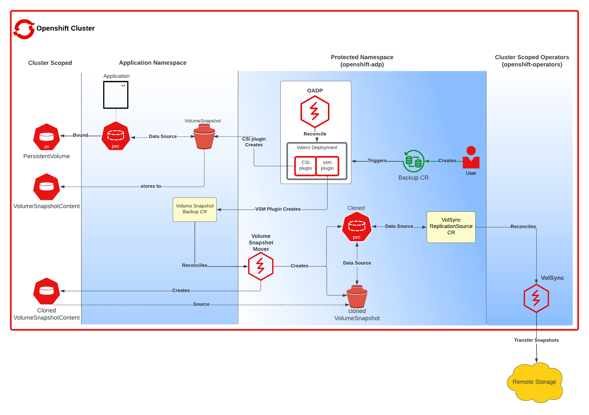
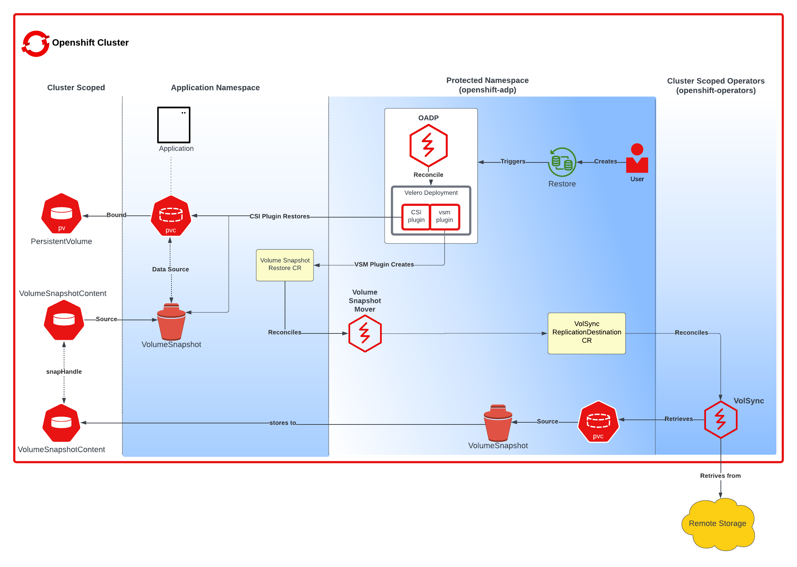

Data Mover (OADP 1.2 or below)

<h2>Introduction</h2>

Data Mover provides portability and durability of CSI volume snapshots by relocating snapshots into an object storage location during backup of a stateful application. These snapshots are then available for restore during instances of disaster scenarios. This blog will discuss the different Data Mover components and how they work together to complete this process.

<h2>What Is CSI?</h2>

One of the more important components of Data Mover to understand is CSI, or Container Storage Interface. CSI provides a layer of abstraction between container orchestration tools and storage systems such that storage vendors can develop a plugin once and have it work across a number of container orchestration systems. CSI defines an API for storage plugins to enable creation of a snapshot to provides point-in-time snapshotting of volumes.

CSI compliant storage plugins are now the industry standard and are the preferred storage plugin type for most container orchestrators including Kubernetes. Most of Kubernetes "in-tree" drivers developed prior to CSI all have a target removal date as most storage vendors move towards deprecating non CSI plugins. However, issues concerning CSI volumes still remain. Some volumes have vendor-specific requirements, and can prevent proper portability and durability. Data Mover works to solve this case, which will be discussed more in the next section.

You can read more about CSI&nbsp;<a href="https://kubernetes-csi.github.io/docs/">here</a>.

<h2>Why We Need Data Mover</h2>

During a backup using Velero with CSI, CSI snapshotting is performed. This snapshot is created on the storage provider where the snapshot was taken. This means that for some providers, such as ODF (OpenShift Data Foundation), the snapshot lives on the cluster. Due to this poor durability, in the case of a disaster scenario, the snapshot is also subjected to disaster.

With VolumeSnapshotMover controller, snapshots are relocated off of the cluster to the targeted backupStorageLocation (generally object storage), providing additional safety.

<h2>OADP's Data Mover Roadmap</h2>

The OADP team introduced the Data Mover feature in OADP-1.1.0 as a tech preview feature.  During the course of OADP-1.1 and OADP-1.2 development we have also been actively contributing to the upstream Velero project.  Our work in the upstream has focused on providing the foundation for the Data Mover feature directly in Velero.  We are pleased to see the upstream Velero project has officially adopted the feature and will release a <a href="https://github.com/vmware-tanzu/velero/wiki/1.12-Roadmap">built in Data Mover</a> in Velero 1.12. 
The Data Mover feature in OADP-1.2 will remain in tech preview as we continue to contribute to and evalute Velero's built in Data Mover for our customers.
<h2>Components</h2>

<h3><a href="https://github.com/openshift/oadp-operator">OADP OPERATOR</a>:</h3>

OADP is the OpenShift API for Data Protection operator. This open source operator sets up and installs Velero on the OpenShift platform, allowing users to backup and restore applications. We will be installing Velero alongside the CSI plugin (modified version).

<h3><a href="https://github.com/vmware-tanzu/velero-plugin-for-csi">CSI PLUGIN</a>:</h3>

The collection of Velero plugins for snapshotting CSI backed PVCs using the <a href="https://kubernetes.io/docs/concepts/storage/volume-snapshots/">CSI snapshot APIs</a>.

<h3><a href="https://github.com/backube/volsync">VOLSYNC</a>:</h3>

VolSync is a Kubernetes operator that performs asynchronous replication of persistent volumes within, or across, clusters. The replication provided by VolSync is independent of the storage system. This allows replication to and from storage types that don’t normally support remote replication. We will be using Volsync’s restic datamover.

<h3><a href="https://github.com/migtools/volume-snapshot-mover">VOLUMESNAPSHOTMOVER (VSM) CONTROLLER</a>:</h3>

The VSM controller is the CSI data movement orchestrator, it is deployed via the OADP Operator once the datamover feature is enabled. This controller has the following responsibilities:

<ul dir="auto">
	<li>Validates the VolumeSnapshotBackup/VolumeSnapshotRestore Custom Resources.</li>
	<li>Makes sure that the data movement workflow has the appropriate storage credentials</li>
	<li>Performs the copy of VolumeSnapshotContent, CSI VolumeSnapshot and PersistentVolumeClaims from application namespace to OADP Operator namespace</li>
	<li>Triggers the data movement process and subsequently performs the cleanup of extraneous resources created.</li>
</ul>

<h3><a href="https://github.com/migtools/velero-plugin-for-vsm">VSM PLUGIN</a>:</h3>

The Velero plugin for the VolumeSnapshotMover(VSM) controller is to facilitate CSI volumesnapshot data movement from an OpenShift cluster to object storage, and vice versa.

<h3><a href="https://github.com/migtools/volume-snapshot-mover/tree/master/config/crd/bases">VOLUMESNAPSHOTMOVER CUSTOM RESOURCE DEFINITIONS (CRDS)</a>:</h3>

<h1>VSB and VSR</h1>

VSB and VSR are Kubernetes custom resources (CRs) that can be used to create backups and restore PersistentVolumeClaims (PVCs).

<h2>VolumeSnapshotBackup (VSB)</h2>

A VSB represents a snapshot of a PVC. It can be used to create a VSR, which can be used to restore the PVC from the snapshot.

<table>
<thead>
<tr>
<th>Field</th>
<th>Description</th>
</tr>
</thead>
<tbody>
<tr>
<td>ProtectedNamespace</td>
<td>The namespace where the Velero deployment is located, and PVC is copied to.</td>
</tr>
<tr>
<td>ResticSecretRef</td>
<td>A reference to a Secret CR that contains the credentials for accessing the restic repository, as well as a reference for the given BSL.</td>
</tr>
<tr>
<td>VolumeSnapshotContent</td>
<td>The name of the VolumeSnapshotContent CR that represents the snapshot.</td>
</tr>
</tbody>
</table>
<h2>VolumeSnapshotRestore (VSR)</h2>

A VSR represents a restore of a PVC from a snapshot. It can be used to restore a PVC from a VSB.

<table>
<thead>
<tr>
<th>Field</th>
<th>Description</th>
</tr>
</thead>
<tbody>
<tr>
<td>ProtectedNamespace</td>
<td>The namespace where the Velero deployment is located, and PVC is copied from.</td>
</tr>
<tr>
<td>ResticSecretRef</td>
<td>A reference to a Secret CR that contains the credentials for accessing the restic repository, as well as a reference for the given BSL.</td>
</tr>
<tr>
<td>VolumeSnapshotMoverBackupRef</td>
<td>A reference to a VolumeSnapshotBackup CR that represents the snapshot that will be used to restore the PVC.</td>
</tr>
</tbody>
</table>

<h2>Backup Process</h2>

	
The CSI plugin is extended to facilitate the data movement of CSI VolumeSnapshots(VS) from the cluster to object storage. When Velero backup is triggered, a snapshot of the application volume is created, followed by the associated VolumeSnapshotContent(VSC). This leads to the creation of a VolumeSnapshotBackup(VSB) per VSC, which triggers the Data Mover process as the VolumeSnapshotMover(VSM) controller begins reconciliation on these VSB instances.  

During the Data Mover process, the VolumeSnapshotMover first validates the VSB and then clones the VSC, followed by VS, and PVC to the protected namespace (default: openshift-adp). The VSM controller uses the cloned PVC as the source PVC and creates a VolSync ReplicationSource CR. VolSync then performs reconciliation on the ReplicationSource CR.  

Subsequently, VolSync initiates the transfer of data from the cluster to the target Remote Storage. In this live demonstration, you will monitor the creation of both VolumeSnapshotBackup and VolumeSnapshotContent. Once the backup is completed, the VSB and VSC are transferred to S3 for the restore process. Finally, the VSM controller deletes all the extraneous resources that were created during the data mover backup process.

<h2>Restore Process</h2>

Previously mentioned, during the backup process, a VSB custom resource is stored as a backup object that contains essential details for performing a volumeSnapshotMover restore. When a VSB CR is encountered, the VSM plugin generates a VSR CR. The VSM controller then begins to reconcile on the VSR CR. Furthermore, the VSM controller creates a VolSync ReplicationDestination CR in the OADP Operator namespace, which facilitates the recovery of the VolumeSnapshot stored in the object storage location during the backup.  

After the completion of the VolSync restore step, the Velero restore process continues as usual. However, the CSI plugin utilizes the snapHandle of the VolSync VolumeSnapshot as the data source for its corresponding PVC.

<h2>Thank you!</h2>
The source of this blog post can be found in the <a href="https://github.com/openshift/oadp-operator/tree/master/blogs/data-mover">oadp-operator repository</a>