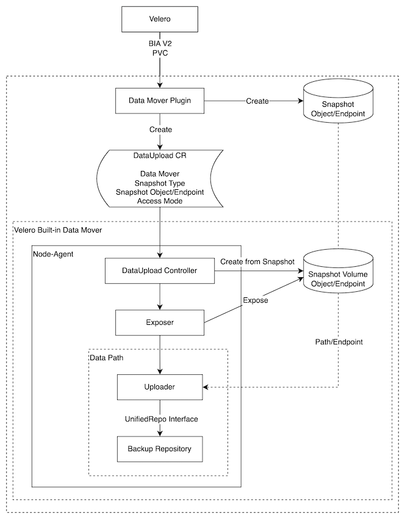

<h1>OADP 1.3 Data Mover</h1>

<h2>Introduction</h2>

OADP 1.3 includes a built-in Data Mover that you can use to move Container Storage Interface (CSI) volume snapshots to a remote object store.  Data Mover provides portability and durability of CSI volume snapshots by relocating snapshots into an object storage location during backup of a stateful application. These snapshots are then available for restore during instances of disaster scenarios. This blog will discuss the new changes in OADP 1.3.0 and the various Data Mover components and how they work together to complete this process.

<h2>How Data Mover has evolved</h2>

The OADP engineering team first introduced the Data Mover feature in OADP 1.1.0. The first step in this journey leveraged Volsync to move volumes off cluster one at a time.   Like many first steps in the industry the feature worked reliably but was not performant for production environments. We knew we had to be able to move multiple volumes at one time and the work would have to be done in the upstream Velero project.  After much deliberation and collaboration in the upstream the OADP team completed it's design for handling <a href=https://github.com/vmware-tanzu/velero/blob/main/design/Implemented/general-progress-monitoring.md>asynchronous operations (BIA/RIA V2)</a> for backups and restores.  This design laid the foundations for Data Mover in both OADP 1.2.0 and OADP 1.3.0.

The Data Mover released in OADP 1.2.0 was performant for production workloads and was on average five times faster in uploading and downloading volumes than OADP 1.1.0.  Around the same time OADP 1.2.0 was released <a href=https://github.com/vmware-tanzu/velero/blob/main/design/Implemented/unified-repo-and-kopia-integration/unified-repo-and-kopia-integration.md>Kopia</a> was introduced and supported in Velero.  Kopia and asynchronous operations opened the door to a built in Data Mover in Velero itself.  A built in Data Mover allows for a more simplified workflow by not having the complexity of integrating an additional component like Volsync.  A design for <a href=https://github.com/vmware-tanzu/velero/blob/main/design/volume-snapshot-data-movement/volume-snapshot-data-movement.md>a built Data Mover</a> was proposed and accepted in the Velero project.  Thus far Red Hat engineering has found this new design for Data Mover to be reliable, performant and easier to maintain for future releases of OADP.  OADP 1.3.0 will bring this new design for a Data Mover to our customers as tech preview and we expect full support of the feature in OADP 1.3.2 to be released early in 2024.

<h2>What Is CSI?</h2>

One of the more important components of Data Mover to understand is CSI, or Container Storage Interface. CSI provides a layer of abstraction between container orchestration tools and storage systems such that storage vendors can develop a plugin once and have it work across a number of container orchestration systems. CSI defines an API for storage plugins to enable creation of a snapshot to provides point-in-time snapshotting of volumes.

CSI compliant storage plugins are now the industry standard and are the preferred storage plugin type for most container orchestrators including Kubernetes. Most of Kubernetes "in-tree" drivers developed prior to CSI all have a target removal date as most storage vendors move towards deprecating non CSI plugins. However, issues concerning CSI volumes still remain. Some volumes have vendor-specific requirements, and can prevent proper portability and durability. Data Mover works to solve this case, which will be discussed more in the next section.

You can read more about CSI&nbsp;<a href="https://kubernetes-csi.github.io/docs/">here</a>.

<h2>Why We Need Data Mover</h2>

During a backup using Velero with CSI, CSI snapshotting is performed. This snapshot is created on the storage provider where the snapshot was taken. This means that for some providers, such as ODF (OpenShift Data Foundation), the snapshot lives on the cluster. Due to this poor durability, in the case of a disaster scenario, the snapshot is also subjected to disaster.

<h2>Components</h2>

<h3><a href="https://github.com/openshift/oadp-operator">OADP OPERATOR</a>:</h3>

OADP is the OpenShift API for Data Protection operator. This open source operator sets up and installs Velero on the OpenShift platform, allowing users to backup and restore applications. We will be installing Velero alongside the CSI plugin.

<h3><a href="https://github.com/vmware-tanzu/velero-plugin-for-csi">CSI PLUGIN</a>:</h3>

The collection of Velero plugins for snapshotting CSI backed PVCs using the <a href="https://kubernetes.io/docs/concepts/storage/volume-snapshots/">CSI snapshot APIs</a>.

<h3><a href="https://github.com/migtools/kopia">Kopia</a>:</h3>

Kopia is a fast and secure open-source backup/restore tool that allows you to create encrypted snapshots of your data and save the snapshots to remote or cloud storage of your choice, to network-attached storage or server, or locally on your machine.

<h3>The DataUpload and DataDownload CR</h3>

The DataUpload (DUCR) and DataDownload (DDCR) are Kubernetes CRs that act as the protocol between data mover plugins and data movers

<h3>The Data Mover (DM)</h3> 

DM is a collective of modules to finish the data movement, specifically, data upload and data download. The modules may include the data mover controllers to reconcile DUCR/DDCR and the data path to transfer data.

<h3>The Velero Built-in Data Mover (VBDM)</h3>

VBDM is the built-in data mover shipped along with Velero, it includes Velero data mover controllers and Velero generic data path.

<h3>The Node-Agent</h3>

Node-Agent is an existing Velero module that will be used to host VBDM

<h3>The Exposer</h3>

Exposer is to expose the snapshot/target volume as a path/device name/endpoint that are recognizable by Velero generic data path. For different snapshot types/snapshot accesses, the Exposer may be different. This isolation guarantees that when we want to support other snapshot types/snapshot accesses, we only need to replace with a new Exposer and keep other components as is.

<h3>DataUpload (DUCR) spec</h3>

A Kubernetes CR that acts as the protocol between data mover plugins and data movers

<table>
<thead>
<tr>
<th>Field</th>
<th>Description</th>
</tr>
</thead>
<tbody>
<tr>
<td>backupStorageLocation</td>
<td>BackupStorageLocation is the name of the backup storage location where the
     backup repository is stored.</td>
</tr>
<tr>
<td>cancel</td>
<td>Cancel indicates request to cancel the ongoing DataUpload. It can be set
     when the DataUpload is in InProgress phase</td>
</tr>
<tr>
<td>csiSnapshot</td>
<td>If SnapshotType is CSI, CSISnapshot provides the information of the CSI
     snapshot.</td>
</tr>
<tr>
<td>dataMoverConfig</td>
<td>DataMoverConfig is for data-mover-specific configuration fields.</td>
</tr>
<tr>
<td>datamover</td>
<td>DataMover specifies the data mover to be used by the backup. If DataMover
     is "" or "velero", the built-in data mover will be used.</td>
</tr>
<tr>
<td>operationTimeout</td>
<td>OperationTimeout specifies the time used to wait internal operations,
     before returning error as timeout.</td>
</tr>
<tr>
<td>snapshotType</td>
<td>SnapshotType is the type of the snapshot to be backed up. Currently the only valid value is CSI</td>
</tr>
<tr>
<td>sourceNamespace</td>
<td>SourceNamespace is the original namespace where the volume is backed up
     from. It is the same namespace for SourcePVC and CSI namespaced objects.</td>
</tr>
<tr>
<td>sourcePVC</td>
<td>SourcePVC is the name of the PVC which the snapshot is taken for.</td>
</tr>
</tbody>
</table>

<h3>Note: For additional specification information please see the <a href=https://github.com/openshift/oadp-operator/blob/master/docs/API_ref.md>API reference documentation</a>

<h3>DataUpload (DUCR) status descriptions</h3>

<table>
<thead>
<tr>
<th>Field</th>
<th>Description</th>
</tr>
</thead>
<tbody>
<tr>
<td>New</td>
<td>The DUCR has been created but not processed by a controller</td>
</tr>
<tr>
<td>Accepted</td>
<td>The object lock has been acquired for this DUCR and the elected controller is trying to expose the snapshot</td>
</tr>
<tr>
<td>Prepared</td>
<td>The snapshot has been exposed, the related controller is starting to process the upload</td>
</tr>
<tr>
<td>InProgress</td>
<td>The data upload is in progress</td>
</tr>
<tr>
<td>Canceling</td>
<td>The data upload is being canceled</td>
</tr>
<tr>
<td>Canceled</td>
<td>The data upload has been canceled</td>
</tr>
<tr>
<td>Completed</td>
<td>The data upload has completed</td>
</tr>
<tr>
<td>Failed</td>
<td>The data upload has failed</td>
</tr>
</tbody>
</table>

<h2>Backup Process</h2>

A user creates a backup CR with the snapshotMoveData option set to true. Velero calls the BIA V2 api to create a CSI VolumeSnapshot request. The status will move from `New` to `InProgress`.  

After the VolumeSnapshots are created, you will see one or more DataUpload CRs created.  You may also see some temporary objects (i.e., pods, PVCs, PVs) created in protected (openShift-adp) namespace. The temporary objects are created to assist in the data movement. The status of the DataUpload object will progress from `New` to `Accepted` to `InProgress`.  

Now working from the Data Mover plugin the CSI snapshot is mounted from the Node-Agent. The DataUpload Controller then works with Kopia ( the uploader ) to move the object off cluster to the Unified Repo Backup repository off cluster.  The status is once again reconciled and the backup CR is moved to complete. 

Users can see the DataUpload objects move to a terminal status of either `Completed`, `Failed` or `Canceled`
Once the object has been uploaded any intermediate objects like the VolumeSnapshot and VolumeSnapshotContents will be removed. Finally the backup object status will be updated with it's terminal status.

A more in depth visualization of the backup workflow with Data Mover is found below.

<h2>Restore Process</h2>

todo

<h2>Thank you!</h2>
The source of this blog post can be found in the <a href="https://github.com/openshift/oadp-operator/tree/master/blogs/data-mover">oadp-operator repository</a>