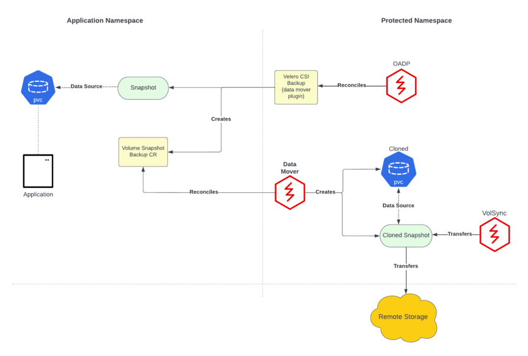
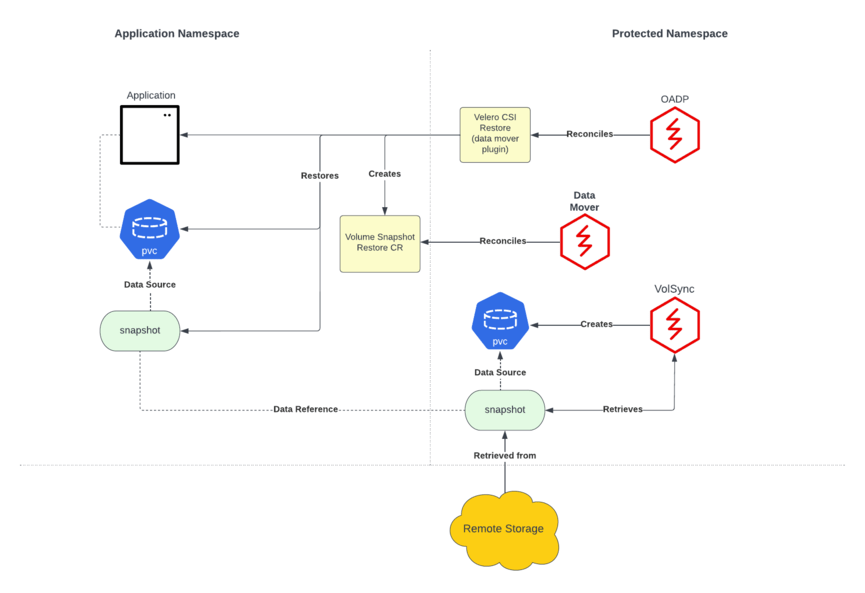

# A Technical Overview of VolumeSnapshotMover

## Table of Contents
- [Introduction](#introduction)
- [What is CSI](#what-is-csi)
- [Why We Need VolumeSnapshotMover](#why-we-need-volumesnapshotmover)
- [Components](#components)
  - [VolSync](#volsync)
  - [Velero](#velero)
  - [VolumeSnapshotMover Controller](#volumesnapshotmover-controller)
  - [VolumeSnapshotMover CustomResourceDefinitions](#volumesnapshotmover-customresourcedefinitions)
- [Backup Process](#backup-process)
- [Restore Process](#restore-process)
- [VolumeSnapshotMover's Future](#volumesnapshotmovers-future)

## Introduction

VolumeSnapshotMover provides portability and durability of CSI volume snapshots 
by relocating snapshots into an object storage location during backup of a 
stateful application. These snapshots are then available for restore during 
instances of disaster scenarios. This blog will discuss the different 
volumeSnapshotMover components and how they work together to complete this 
process.

## What Is CSI?

One of the more important components of VolumeSnapshotMover to understand is CSI, 
or Container Storage Interface. CSI provides a layer of abstraction between container 
orchestration tools and storage systems such that users do not need to be 
informed on the differences between storage providers’ needs and requirements.
It also provides point-in-time snapshotting of volumes.

CSI volumes are now the standard, and back most Cloud Native applications. 
However issues concerning CSI volumes still remain. Some volumes have 
vendor-specific requirements, and can prevent proper portability and durability. 
VolumeSnapshotMover works to solve this case, which will be
discussed more in the next section.

You can read more about CSI [here](https://kubernetes.io/blog/2019/01/15/container-storage-interface-ga/). 

## Why We Need VolumeSnapshotMover

During backup using Velero with CSI, CSI snapshotting is performed. This 
snapshot is created on the storage provider where the snapshot was taken. 
This means that for some providers, such as ODF, the snapshot lives on the 
cluster. Due to this poor durability, in the case of a disaster scenario, the 
snapshot is also subjected to disaster. 

## Components 

### VolSync

### Velero

### VolumeSnapshotMover Controller

### VolumeSnapshotMover CustomResourceDefinitions

## Backup Process

- (steps here)

## Restore Process

- During restore, the Velero CSI plugin is extended to support volumeSnapshotMover 
functionality. As mentioned previously, during backup, a `volumeSnapshotBackup` custom 
resource is stored as a backup object. This CR contains details pertinent to 
performing a volumeSnapshotMover restore. 

- Once a `volumeSnapshotBackup` CR is encountered, a `volumeSnapshotRestore` CR 
is created by the extended Velero CSI plugin. The volumeSnapshotMover controller 
then begins to reconcile on the `volumeSnapshotRestore` CR. Here, a VolSync 
`replicationDestination` is created by the volumeSnapshotMover controller in the 
protected namespace. This CR will recover the `volumeSnapshot` that was 
stored in the object storage location during backup. 

- After the VolSync restore step completes, the Velero restore continues as usual. 
However, the extended CSI plugin uses the VolSync `volumeSnapshot` `snapHandle` 
as the data source for its associated PVC.  

- The stateful application data is then restored, and disaster is averted.

## VolumeSnapshotMover's Future

The most impending plan for volumeSnapshotMover is to improve performance. 
A new Velero ItemAction plugin will be introduced to allow for asynchronous 
operations during backup and restore. 
