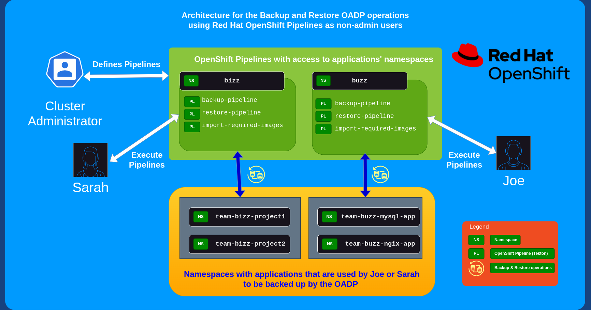

# Create a project and user with non-admin access that can execute an OADP backup

## Background
Traditionally Red Hat OpenShift API for Data Protection ( OADP ) has been utilized by OpenShift administrators to provide data protection for the tenants in the clusters they manage.  In this model the OpenShift administrators are responsible for the execution of the backups of their tenant's data.  The top down approach may be appropriate for some administrators, however others may want to delegate backup and restore execution to their tenants and application owners. 

The purpose of this demonstration is to provide a comprehensive example for OpenShift administrators on how OADP and OpenShift Pipelines may be configured to provide users that are non-administrators access to trigger an OADP backup and restore workflow.

This example uses [OpenShift Pipelines](https://cloud.redhat.com/blog/introducing-openshift-pipelines) and configures a Tekton pipeline for a non-admin user that has access to OADP resources to trigger a backup.  The non-admin user **can execute** the pipeline but **can not** edit the pipeline, additionally the non-admin user can only backup and restore namespaces to which they have access.  The administrator is allowed to configure OADP for their users, and users can execute a backup or restore as needed without the administrator intervention.

## Project Architecture
OpenShift administrators can utilize OpenShift pipelines and OADP to best fit their own needs.  An example architecture is shown below that provides OpenShift pipelines for backing up and restoring projects with limited roles for non-admins.  The non-admin in this case Joe or Sarah are allowed to trigger OADP backup and an OADP restore but neither Joe or Sarah can edit the OpenShift pipelines or accidently restore a backup to the wrong namespace.  Joe and Sarah will have a full history of all the executions of the backups and restores in the pipeline-runs section of the pipeline.  The OpenShift administrator may also create Tekton [pipeline triggers](https://cloud.redhat.com/blog/guide-to-openshift-pipelines-part-6-triggering-pipeline-execution-from-github) to schedule a backup of a namespace based on a specific event.




## Technical Details of this demonstration
A user may want to change the backup custom resource, or other aspects of this demo. Simply fork this git repository and update the settings and configuration. The following provides a more in depth technical specification.

* To change the backup or restore custom resource, update the [cr's in the oadp-tekton-container directory](oadp-tekton-container/)
* The oauth and some of the user settings can be found in the [demo_users](demo_users) directory
* Some of the templates used in this demonstration are templated and found in [install_templates/templates](install_templates). The [install.sh](install.sh) script executes `oc process` to substitute variables and renders to the directory of the users choice or by default to `/tmp/oadp_non_admin` 
* The parameters that users are allowed to set in the Tekton pipeline are defined in [05-build-and-deploy.yaml](install_templates/templates/05-build-and-deploy.yaml).
* A more [advanced velero backup custom resource](oadp-tekton-container/advanced_backup.yaml) is provided as an example but not used in this demo

## Sample Applications
If you require a sample application while working through the instructions, you can find viable sample applications via the following links:
  * https://github.com/openshift/oadp-operator/tree/master/tests/e2e/sample-applications/nginx
  * https://github.com/openshift/oadp-operator/tree/master/tests/e2e/sample-applications/mysql-persistent

## Known Issues
* Advanced backup and restore options are not included in this demo.

## Steps

### Prerequisites
* Install [OpenShift Pipelines (Tekton)](https://docs.openshift.com/container-platform/latest/cicd/pipelines/installing-pipelines.html)
* Check that [OADP is installed](https://docs.openshift.com/container-platform/latest/backup_and_restore/application_backup_and_restore/installing/about-installing-oadp.html)
* Check OADP configuration which must have at least one [DPA CR](https://github.com/openshift/oadp-operator/blob/master/docs/install_olm.md#create-the-dataprotectionapplication-custom-resource)
* It is recommended to the user to ensure backup and restore operations are working prior to running this demonstration.

There is a shell script to check those Prerequisites:
```shell
$ ./check_prerequisites.sh
[...]
######################
Summary:
	 Tekton installed:	True
	 OADP installed:	True
	 OADP configured:	True
######################

```

### First create non-admin users 
* **NOTE** The script [demo_users/create_demousers.sh](demo_users/create_demousers.sh) is for demo purposes only.

A cluster with non-admin users that also have applications deployed as any non-admin user can potentially skip these steps. 

  *  This step can easily be done manually and the script skipped by executing the steps documented [here](https://www.redhat.com/sysadmin/openshift-htpasswd-oauth)
  *  If a user has been created manually, the created user requires the `view` role as demonstrated here:
  ```shell
  $ USER=buzz1
  $ PROJECT=buzz
  $ oc create namespace $PROJECT
  $ oc adm policy add-role-to-user view $USER -n $PROJECT
  ```
* While logged in as the kubeadmin user, execute the following:
```
$ cd demo_users
$ ./create_demousers.sh -h
Create the OADP non-admin users

Syntax: scriptTemplate [-h|-n|-c|-p|-x|-d]
options:
h     Print this Help.
n     demouser base name
x     the project name
c     the number of users to be created
p     the common password
d     The directory where the htpasswd file will be saved
```

Example:
```
$ ./create_demousers.sh -n buzz -c 2 -p passw0rd -x buzz
```
This will create two new users in openshift called buzz1 and buzz2 with a default password of `passw0rd`.


### Login as the non-admin user
* Test the non-admin user first before moving on.
* The user should be able to be logged in, and have view access to the created project/namespace.
* The demo user in this case `buzz1` will also require access to the namespaces that are to be backed up and restored.

For example if user buzz1 is meant backup the namespace mysql-persistent:
```
$ oc adm policy add-role-to-user edit buzz1 -n mysql-persistent
```
**Note** The non-admin user should have `view` access to the namespace that provides the Tekton pipelines, and view or higher access like `edit` to the namespaces the user is intended to backup and restore.

Outside of this demonstration users and namespaces that are required to be backed up would have already been setup.  This step should only be required for demonstration purposes.


### Setup the Tekton pipelines 

* logged in as the kubeadmin user, execute the following:

Using an example with a user called buzz1 in a project called buzz1
```
$ ./install.sh -h
Create the OADP non-admin templates

Syntax: scriptTemplate [-h|-p|-u|-d]
options:
h     Print this Help.
p     Name of the Project or Namespace
u     Name of the non-admin user
d     The directory where the templates will be saved


$ ./install.sh -p buzz -u buzz1 -d /tmp/buzz1
```

The project buzz will be created and the user buzz1 updated.

* Navigate to the pipelines menu as the buzz1 user


### Import the required Tekton images

* Click the `import-required-images` pipeline.
* Select `Actions`, and `Start`


### Trigger a backup as a non-admin user

* You should now see a new Tekton pipeline created call `backup-pipeline`
  * Select `Actions`, and `Start`
    * Type out a name for the backup e.g. `backupmysql1`
    * Type out the namespace to be backed up e.g. `mysql-persistent`
    * Select `workspace` should be:
      * A VolumeClaimTemplate
      * In this demo a volume claim using the gp2-csi storage class was created.


* Watch and wait for the backup to complete


### Delete the application
Now that you have backed up an application, delete the application's namespace and we'll proceed to the restore pipeline.

```shell
# oc delete namespace <namespace>
$ oc delete namespace mysql-persistent
```

### Restore the application
In the buzz1 project, click on `Pipelines` and the `restore-pipeline`


Follow the same steps and the same `backup name` used in the backup pipeline.
* Provide a restore name e.g. `restoremysql1`
* The backup name in the example was `backupmysql1`


The restore should run to completion.


The mysql-persistent application should be created and up running!


#### Complete
Thank you for walking through this OADP demonstration.


