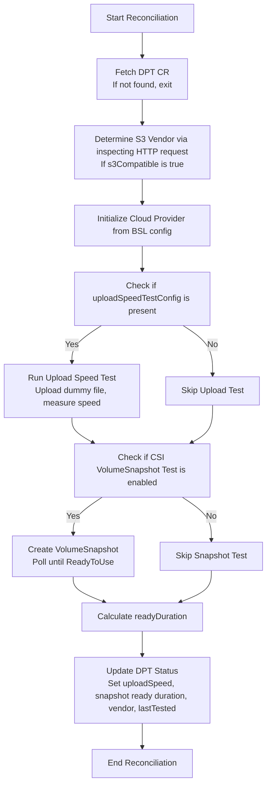

# DataProtectionTest CRD and Controller Design

## Abstract

This design introduces the **DataProtectionTest** (DPT) CRD and its controller to evaluate data protection performance—including backup upload and volume snapshot readiness—in an OpenShift cluster.. It supports two tests:

1. **Upload Speed Test:** Measures the speed at which a dummy file is uploaded to cloud object storage using configuration from a BackupStorageLocation.
2. **CSI VolumeSnapshot Test:** Creates a VolumeSnapshot from a specified PVC and measures the time taken (as a duration) for the snapshot to become ready.

Additionally, the design includes a mechanism to determine the S3-compatible vendor.

## Background

In several customer environments, backup/restore operations have experienced delays or stalls due to poor network connectivity, throttling at the cloud provider, or misconfigurations in BackupStorageLocation settings. Given the critical role of backup performance in disaster recovery, administrators need real-time, accurate metrics on how fast data uploads occur and how promptly snapshots are created.

This design addresses that need by measuring:

- **Upload speed:** How quickly data is transferred to object storage.
- **Snapshot performance:** How long a CSI VolumeSnapshot takes to become ReadyToUse.
- **S3 compatibility:** Identifying the specific S3 vendor by inspecting HTTP response headers from the storage endpoint.

## Goals

- Upload a test file and compute the speed in Mbps.
- Create a CSI VolumeSnapshot and measure the time taken for it to become ready (reported as a duration).
- Identify the S3-compatible vendor using an HTTP call that inspects response headers.
- Expose all results—including upload speed, snapshot ready duration, and S3 vendor—in the CRD status.
- Leverage existing BackupStorageLocation (from Velero/DPA) for configuration.


## Non-Goals

- This design will not create or modify BackupStorageLocation entries in OADP.
- It will not implement download or latency tests, focusing solely on upload speed.
- Scheduling of recurring tests is not supported in the initial version.

## High-Level Design
Components involved and their responsibilities:

- **DataProtectionTest (DPT) CRD:**
    - **Spec:**
        - **backupLocation:** Contains Velero-based backup storage configuration.
        - **uploadSpeedTestConfig:** Test parameters for the upload (file size, test timeout).
        - **CSIVolumeSnapshotTestConfig:** Test parameters for the CSI VolumeSnapshot test (snapshot class, source PVC name, and importantly the PVC namespace, plus snapshot timeout).
    - **Status:**
        - **UploadTestStatus:** Groups upload speed (in Mbps), success flag, and error messages.
        - **SnapshotTestStatus:** Groups the snapshot test results, reporting status and the duration taken for the snapshot to be ready.
        - **S3Vendor:** Reports the detected S3 vendor string from vendor determination.
- **DataProtectionTest Controller:**
    - Monitors DataProtectionTest CRs.
    - Extracts configuration from the Velero backup location.
    - Determines the S3 vendor via an HTTP HEAD call.
    - Initializes the appropriate cloud provider using the CloudProvider interface.
    - Executes the upload test and, if enabled, the CSI VolumeSnapshot test.
    - Updates the CRD status with grouped results.
- **CloudProvider Interface:**
    - Defines an `UploadTest(ctx, config, bucket, fileSizeMB) (int64, error)` function.
    - AWS-specific implementation (S3Provider) is provided using the AWS SDK.
- **Vendor Determination Logic:**
    - A helper function performs an HTTP HEAD call to the **s3Url** and inspects headers (especially the `Server` header) to determine the vendor (e.g., "AWS", "MinIO", etc.).
- **OADP/DPA Integration:**
    - BSL Configuration details from the DPA/Velero CR flow into the DataProtectionTest CR through established integrations.

## Detailed Design

#### Proposed DataProtectionTest CRD:

DataProtectionTest (DPT) CRD would look like:

```yaml
apiVersion: oadp.openshift.io/v1alpha1
kind: DataProtectionTest
metadata:
  name: my-data-protection-test
spec:
  backupLocation:
    velero:
      provider: aws                # Cloud provider type (aws, azure, gcp)
      default: true
      objectStorage:
        bucket: sample-bucket
        prefix: velero
      config:
        region: us-east-1
        profile: "default"
        insecureSkipTLSVerify: "true"
        s3Url: "https://s3.amazonaws.com" # indicates s3 compatibility
      credential:
        name: cloud-credentials     # Secret for cloud credentials
        key: cloud
  uploadSpeedTestConfig:
    fileSize: "100MB"                # Size of file to upload for testing
    testTimeout: "60s"               # Maximum duration for upload test
  CSIVolumeSnapshotTestConfig:
    snapshotClassName: "csi-snapclass"
    volumeSnapshotSource:
      persistentVolumeClaimName: "my-pvc"
      persistentVolumeClaimNamespace: "my-pvc-namespace"
    timeout: "120s"                 # Snapshot readiness timeout
status:
  lastTested: "2024-10-08T10:00:00Z"
  uploadTest:
    speedMbps: 55.3
    success: true
    errorMessage: ""
  snapshotTest:
    status: "Ready"
    readyDuration: "2m"             # Duration taken for snapshot to be ready
    errorMessage: ""
  s3Vendor: "AWS"

```

#### CloudProvider interface

```go
package cloudprovider

// CloudProvider defines the interface for cloud-based upload tests.
type CloudProvider interface {
    // UploadTest performs a test upload and returns the speed in Mbps or error.
    UploadTest(ctx context.Context, config v1alpha1.UploadSpeedTestConfig, bucket string, fileSizeMB int) (int64, error)
}

```

#### Changes to DPA CRD BSL Configuration spec:

The DPA CRD configuration includes fields to enable and configure the Upload Speed Test (UST) within the BSL configuration.

```yaml
apiVersion: oadp.openshift.io/v1alpha1
kind: DataProtectionApplication
metadata:
  name: sample-dpa
spec:
  backupStorageLocations:
    - name: aws-backup-location
      BSLSpec: ...
      uploadSpeedTest:
        enabled: true              # Flag to enable upload speed test
        fileSize: "10MB"           # Size of the file to be uploaded
        testTimeout: "60s"         # Timeout for the upload test
```

#### DPT controller workflow General workflow for DPT CR processing - user created or via DPA CR):

1. Retrieve the DPT CR: At the start of the reconcile loop the controller fetches the DPT CR from the API server
2. Determine the s3 compatible vendor if applicable: Identify the s3 vendor by performing an HTTP request to the configured s3 storage and inspecting the response headers.
```go
// determineVendor inspects the s3Url via an HTTP HEAD request
// and extracts the S3-compatible vendor name from the Server header.
func (r *DataProtectionTestReconciler) determineVendor(ctx context.Context, dpt *oadpv1alpha1.DataProtectionTest) error {
    // check if s3Url is specified 
    // Send an HTTP HEAD request to the storage URL
    // Parse response 'Server' header to detect vendor
}
```
3. Initialize the Cloud Provider for the Upload Test: Instantiate a cloud provider based on the BSL config.
```go
// initializeProvider constructs a CloudProvider (currently S3) based on config and credentials from the DPT CR.
func (r *DataProtectionTestReconciler) initializeProvider(dpt *oadpv1alpha1.DataProtectionTest) (cloudprovider.CloudProvider, error) {
	
    // Get region (default to us-east-1 if not specified)
    // s3Url is required for custom endpoints (e.g., MinIO, Ceph)
    // Load credentials from Kubernetes secret
    // Parse access/secret key pair from the secret data 
	// Return a CloudProvider instance (S3Provider)
}

```
4. Execute the Upload Speed test: Upload a dummy file of specified size to the object storage to measure the data transfer speed.
```go
// runUploadTest uploads a dummy file to object storage and calculates the speed in Mbps.
func (r *DataProtectionTestReconciler) runUploadTest(ctx context.Context, dpt *oadpv1alpha1.DataProtectionTest, cp cloudprovider.CloudProvider) error {
    // Parse the file size (e.g., "100MB" -> 100)
    // Upload to the target bucket defined in the BackupLocation
    // Success: update speed on status
}

```
5. Execute the CSI VolumeSnapshot Test (If enabled): Create a CSI VolumeSnapshot for a specified PVC and measure the time taken for it to be ready.
```go
// runSnapshotTest creates a CSI VolumeSnapshot from a PVC and measures the time until it's ReadyToUse.
func (r *DataProtectionTestReconciler) runSnapshotTest(ctx context.Context, dpt *oadpv1alpha1.DataProtectionTest) error {
    // Get PVC and snapshot class info
    // Parse snapshot readiness timeout duration
    // Create the VolumeSnapshot
    // Poll for ReadyToUse status within timeout
    // Check if snapshot is ReadyToUse
    // Success: capture duration
}

```
6. Update the Status of the DPT CR: Consolidate results from the upload test, snapshot test, and vendor detection, and update the CR status.




#### Integration with DPA controller:
1. During reconciliation, the DPA controller will inspect each BackupStorageLocation (BSL) defined in the DataProtectionApplication (DPA) CR.
2. If a BSL has `uploadSpeedTest.enabled: true`, the controller will:
    1. Construct a corresponding `DataProtectionTest` (DPT) CR **per BSL**.
    2. Populate `spec.backupLocation` using the BSL's provider, object storage, config, and credentials.
    3. Populate `spec.uploadSpeedTestConfig` using values from `uploadSpeedTest.fileSize` and `uploadSpeedTest.testTimeout`.

**Note:**
- Upload speed test configuration is supported per `BackupStorageLocation` (BSL) via the DPA CR using the `uploadSpeedTest` field.
- There is no support for CSI VolumeSnapshot test configuration in the DPA CR.
- Users who wish to run snapshot readiness tests must manually create a `DataProtectionTest` (DPT) CR with the appropriate `CSIVolumeSnapshotTestConfig`.


## Implementation

- We are targeting this feature for OADP 1.5
- The implementation would be done in small phases:
    1. First phase would independent introduction of DPT CRD and controller (only for AWS provider)
    1. Then next would be enabling integration with OADP/DPA
    1. Followed by remaining cloud provider Azure and GCP

## Future Scope

- Recurring Tests: Support for recurring tests could be added by integrating with a scheduling system.
- Enhanced Metrics: Consider additional metrics like latency or download speed.

## Open Questions
