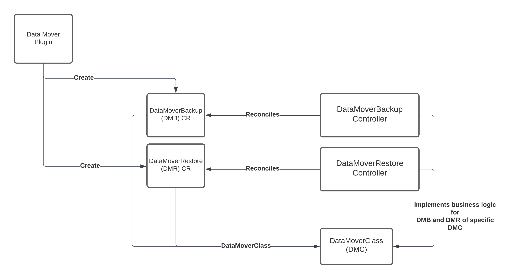

# Data Mover CRD design

## Release Signoff Checklist

- [ ] Enhancement is `implementable`
- [ ] Design details are appropriately documented from clear requirements
- [ ] Test plan is defined
- [ ] User-facing documentation is created

## Open questions

* PVC/VolumeSnapshot mover - Should the Datamover Backup process be triggered off a PVC or a snapshot? 
    * Should we support both types and provide user an option to pick either PVC or snapshot?


## Summary
OADP operator currently supports backup and restore of applications backed by CSI volumes by leveraging the Velero CSI plugin. The problem with CSI snapshots on some providers such as ODF is that these snapshots are local to the Openshift cluster and cannot be recovered if the cluster gets deleted accidentally or if there is a disaster. In order to overcome this issue, DataMover is made available for users to save the snapshots in a remote storage. 

## Motivation

Create an extensible design to support various data movers that can be integrated with OADP operator. Vendors should be able to bring their own data mover controller and implementation, and use that with OADP operator.

## Goals
* Create an extensible data mover solution
* Supply a default data mover option 
* Supply APIs for DataMover CRs (eg: DataMoverBackup, DataMoverRestore,DataMoverType)
* Supply a sample codebase for the Data Mover plugin and controller implementation


## Non Goals
* Maintain 3rd party data mover implementations
* Adding a status watch controller to Velero

## User stories

Story 1: 
As an application developer, I would like to save the CSI snaphots in a S3 bucket. 

Story 2:
As a cluster admin, I would like to be able to restore CSI snapshots if disaster happens.

## Design & Implementation details

This design supports adding the data mover feature to the OADP operator and facilitates integrating various vendor implemented data movers. 



Note: We will be supporting VolSync as the default data mover. 

The DataMoverBackup Controller will watch for DataMoverBackup CR. Likewise, DataMoverRestore Controller will watch for DataMoverRestore CR. Both of these CRs will have a reference to a DataMoverType. 

`DataMoverType` is a cluster scoped Custom Resource that will have details about the data mover provisioner. The provisioner will be responsbile for creating a DataMover plugin that will create a `DataMoverBackup` CR & `DataMoverRestore` CR. They will also be responsible for implementing the logic for DataMoverBackup & DataMoverRestore controller that corresponds to their data mover. The spec will also include a field to identify the PVCs that would be moved with the given provisioner. 

```
apiVersion: oadp.openshift.io/v1alpha1
kind: DataMoverType
metadata:
  annotations:
    oadp.openshift.io/default: "true"
  name: <name>
spec:
  provisioner: <VolSync>
  pvcIdentifier: <tagname>

```

The above `DataMoverType` name will be referenced in `DataMoverBackup` & `DataMoverRestore` CRs. This will help in selecting the data mover implementation during runtime. If the `DataMoverType` name is not defined, then the default `DataMoverType` will be used, which in this case will be `VolSync`

### Data Mover Backup

Assuming that the `DataMover Enable` flag is set to true in the DPA config, when a velero backup is created, it triggers DataMover plugin to create the `DataMoverBackup` CR in the app namespace. The plugin looks up for the PVCs in the user namespace mentioned in the velero backup and creates a `DataMoverBackup` CR for every PVC in that namespace.

`DataMoverBackup` CR supports either a volumesnapshot or a pvc as the type of the backup object. If the velero CSI plugin is used for backup, `VolumeSnapshot` is used as the type or else `PVC`
is used.

```
apiVersion: oadp.openshift.io/v1alpha1
kind: DataMoverBackup
metadata:
  name: <name>
spec:
  dataMoverType: <datamovertype name> 
  - type: <VolumeSnapshot|PVC>
    sourceClaimRef:
      name: <snapshot_content_name>|<pvc_name>
      namespace: <namespace>  //optional 
    config:     //optional based on the datamover impl

```
### Data Mover Restore
When a velero restore is triggered, the DataMover plugin looks for `DataMoverBackup` in the backup resources. If it encounters a `DataMoverBackup` resource, then the plugin will create a `DataMoverRestore` CR in the app namespace. It will populate the CR with the details obtained from the `DataMoverBackup` resource. 

```
apiVersion: oadp.openshift.io/v1alpha1
kind: DataMoverRestore
metadata:
  name: <name>
spec:
  dataMoverType: <datamovertype name>
  destinationClaimRef:
    name: <PVC_claim_name>
    namespace: <namespace>
  config:     //optional based on the datamover impl
```
Config section in the above CR is optional. It lets the user specify extra parameters needed by the data mover. For eg: VolSync data mover needs restic secret to perform backup & restore

eg: 

```
apiVersion: oadp.openshift.io/v1alpha1
kind: DataMoverRestore
metadata:
  name: <name>
spec:
  dataMoverType: <datamovertype name>
  destinationClaimRef:
    name: <PVC_claim_name>
    namespace: <namespace>
  config:     //optional based on the datamover impl
    resticSecret:
      name: <secret_name>
```

We will provide a sample codebase which the vendors will be able to extend and implement their own data movers. 


### Default OADP Data Mover controller

VolSync will be used as the default Data Mover for OADP and `restic` will be the supported method for backup & restore of PVCs. When OADP operator gets installed, VolSync will be installed alongside. Method of installation is TBD (Waiting on VolSync operator to be available. If not, we will do a  helm install). Restic repository details are configured in a `secret` object which gets used by the VolSync's resources. This design takes advantage of VolSync's two resources - `ReplicationSource` & `ReplicationDestination`. `ReplicationSource` object helps with taking a backup of the PVCs and using restic to move it to the storage specified in the restic secret. `ReplicationDestination` object takes care of restoring the backup from the restic repository. There will be a 1:1 relationship between the replication src/dest CRs and PVCs.

We will follow a two phased approach for implementation of this controller. For phase 1, the user will create a restic secret. Using that secret as source, the controller will create on-demand secrets for every backup/restore request. For phase 2, the user will provide the restic repo details. This may be an encryption password and BSL reference, and the controller will create restic secret using BSL info, or they can supply their own backup target repo and access credentials. We will be focussing on phase 1 approach for this design.

```
...
DataMoverEnable: True/False
...
```

If the DataMover flag is enabled, then the user creates a restic secret with all the following details,
```
apiVersion: v1
kind: Secret
metadata:
  name: restic-config
type: Opaque
stringData:
  # The repository url
  RESTIC_REPOSITORY: s3:s3.amazonaws.com/<bucket>
  # The repository encryption key
  RESTIC_PASSWORD: <password>
  # ENV vars specific to the chosen back end
  # https://restic.readthedocs.io/en/stable/030_preparing_a_new_repo.html
  AWS_ACCESS_KEY_ID: <access_id>
  AWS_SECRET_ACCESS_KEY: <access_key>
```
*Note: More details for installing restic secret in [here](https://volsync.readthedocs.io/en/stable/usage/restic/index.html#specifying-a-repository)*


Like any other plugins, DataMover plugin gets deployed as an init container in the velero deployment. This plugin will be responsible for creating `DataMoverBackup` & `DataMoverRestore` CRs. 

Once a DataMoverBackup CR gets created, the controller will create the corresponding `ReplicationSource` CR in the protected namespace. VolSync watches for the creation of `ReplicationSource` CR and copies the PVC data to the restic repository mentioned in the `restic-secret`.  
```
apiVersion: volsync.backube/v1alpha1
kind: ReplicationSource
metadata:
  name: database-source
  namespace: openshift-adp
spec:
  sourcePVC: <pvc_name>
  trigger:
    manual: <trigger_name>
  restic:
    pruneIntervalDays: 15
    repository: restic-config
    retain:
      hourly: 1
      daily: 1
      weekly: 1
      monthly: 1
      yearly: 1
    copyMethod: None
```

Similarly, when a DataMoverRestore CR gets created, controller will create a `ReplicationDestination` CR in the protected namespace. VolSync controller copies the PVC data from the restic repository to the protect namespace, which then gets transferred to the user namespace by the controller.

```
apiVersion: volsync.backube/v1alpha1
kind: ReplicationDestination
metadata:
  name: <protected_namespace>
spec:
  trigger:
    manual: <trigger_name>
  restic:
    destinationPVC: <pvc_name>
    repository: restic-config
    copyMethod: None
```

A status controller is created to watch VolSync CRs. It watches the `ReplicationSource` and`ReplicationDestination` objects and updates VolumeSnapShot CR events. 

*Note: Potential feature addition to Velero: A status watch controller for DataMover CRs. This can be used to update Velero Backup/Restore events with the DataMover CR results*

Data mover controller will clean up all controller-created resources after the process is complete.


### Support for multiple data mover plugins
`DataMoveType` spec will support the following field,
    `pvcIdentifier: <tagname>`
PVC must be labelled with the `<tagname>`, to be moved by the specific `DataMoverType`. User/Admin of the cluster must label the PVCs with the required `<tagname>` and map it to a `DataMoverType`. If the PVCs are not labelled, it will be moved by the default datamover.

#### Alternate options
PVCs can be annotated with the `DataMoverType`, and when a backup is created, the controller will look at the DataMoverType and add it to the `DataMoverBackup` CR. 

 
---

## References
Previous designs:
* Alternate design - https://hackmd.io/uYrC2StuTT-zCSUSf4xlRw
* Initial design - https://hackmd.io/8uEzXeD8TKCYF9uUdroDXA
