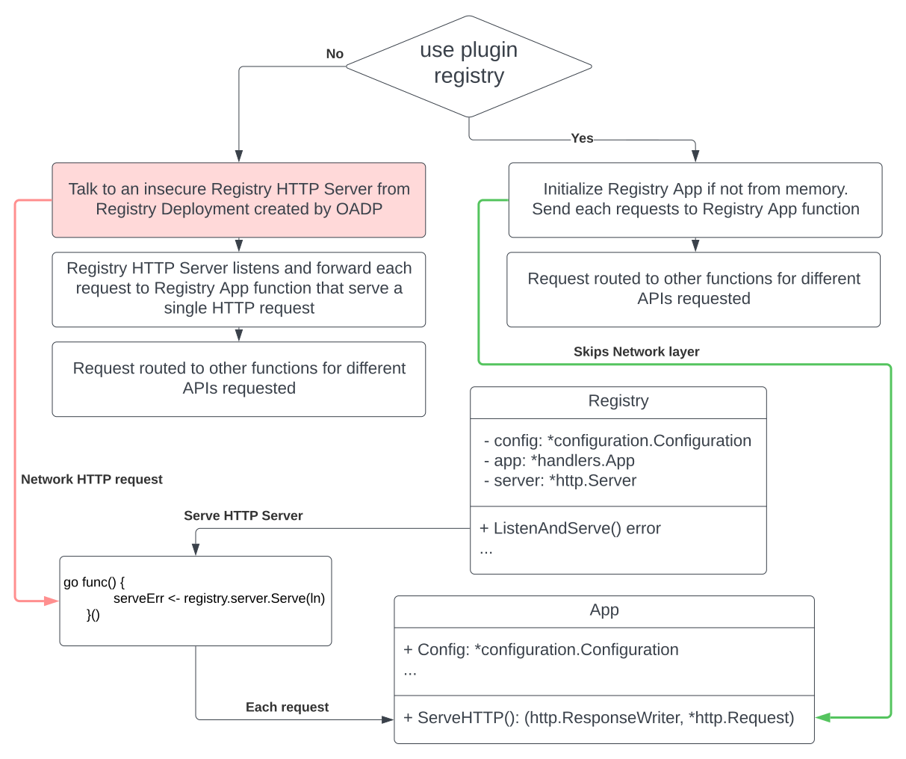

# Plugin Registry

Plugin registry enhancement replaces current usage of [registry](https://github.com/konveyor/distribution/) [deployment](https://kubernetes.io/docs/concepts/workloads/controllers/deployment/) insecure [routes](https://access.redhat.com/documentation/en-us/openshift_container_platform/4.10/html/networking/configuring-routes) by talking to registry API server inside the velero container itself via openshift-velero-plugin.

## Release Signoff Checklist

- [x] Enhancement is `implementable`
- [ ] Design details are appropriately documented from clear requirements
- [ ] Test plan is defined
- [ ] User-facing documentation is created

## Open Questions [optional]

Do we want registry logs to be included in velero backup and/or restore logs?

## Summary

removes a listening HTTP server and connect [openshift-velero-plugin](https://github.com/openshift/openshift-velero-plugin/) directly with the [distribution/distribution](https://github.com/distribution/distribution) code to serve requests from [container/image/copy](https://github.com/containers/image/tree/main/copy) method as needed. A "library" to help achieve this is [kaovilai/udistribution](https://github.com/kaovilai/udistribution) which may be moved to konveyor org.

## Motivation

Current image backup workflow depends on registry deployment with exposed insecure routes allowing anyone knowing the URL of the exposed routes to push or pull images to the registry.
There are some transient errors such as pod health probe timeouts that are resolved by this design.
This approach will eliminate registry deployment dependency which the operator will no longer have to reconcile.

### Goals

- Exposed routes are eliminated.
- Remove dependency on registry deployment.
- Be backward compatible with existing image backup workflow.
- Keep deduplication across backups.

### Non-Goals

Creating another custom resource and a controller to replace usage of [distribution/distribution](https://github.com/distribution/distribution).

## Proposal

We propose that insecure routes are eliminated by removing registry deployment, and making network requests to [distribution/distribution](https://github.com/distribution/distribution) storage drivers such as [`s3-aws`](https://github.com/distribution/distribution/blob/main/registry/storage/driver/s3-aws/s3.go),`gcs` , and `azure` from within velero pod via openshift-velero-plugin.

### Implementation Details/Notes/Constraints [optional]

The logs relating to registry will be mixed into velero pod logs

### Security, Risks, and Mitigations

As more backups and/or new Backup Storage Location are added and thus caching more initialized registries configurations, we may want to periodically garbage collect unused or outdated backup storage location registry configurations to optimize memory usage.

## Design Details

[udistribution](https://github.com/kaovilai/udistribution) library has been created to help with the following:
- Initializing Registry [App](https://github.com/distribution/distribution/blob/b5e2f3f33dbc80d2c40b5d550541467477d5d36e/registry/handlers/app.go#L58) from configuration resolved from environment variables passed via [function parameters](https://github.com/kaovilai/udistribution/blob/d7f491d7c354caa1df6893d20c735b9c08c20108/pkg/client/client.go#L58).
- Add a custom container/images docker transport with modified [makeRequestToResolvedURLOnce()](https://github.com/kaovilai/udistribution/blob/d7f491d7c354caa1df6893d20c735b9c08c20108/pkg/image/udistribution/docker_client.go#L559) to use [Registry App ServeHTTP method](https://github.com/kaovilai/udistribution/blob/d7f491d7c354caa1df6893d20c735b9c08c20108/pkg/image/udistribution/docker_client.go#L613) instead of sending HTTP requests to a listening HTTP server.

OADP-Operator controller manager will
 * set environment variables on the velero container
   * tell openshift-velero-plugin to initialize [udistribution transport](https://github.com/kaovilai/udistribution/blob/main/pkg/image/udistribution/docker_transport.go#L36) to be used to talk to storage drivers such as s3

openshift-velero-plugin will
 * resolve registry secret for a given Backup Storage Location by looking up the secret in the namespace of the Backup Storage Location.
 * initialize [udistribution transport](https://github.com/kaovilai/udistribution/blob/main/pkg/image/udistribution/docker_transport.go#L36) to be used to talk to storage drivers such as s3, gcs, and azure
 * substitute transport name given to `image.Copy()` from `docker://` to [generated udistribution transport name](https://github.com/openshift/openshift-velero-plugin/blob/1600327cb3f6f9f60ade880aef8fe16d34e6fb04/velero-plugins/imagecopy/imagestream.go#L102) for bsl when plugin registry is requested.

### Test Plan
- Check for no user experience changes
- Image backup continues to work and upload to s3/azure/gcp

#### Test Changes
- Remove check for ready registry deployments
- Deploy a dummy bsl registry deployment and check for removal

### Upgrade / Downgrade Strategy

Upon upgrading, operator will attempt to for detected BSLs remove any remaining registry deployments.

<!--
## Implementation History

Major milestones in the life cycle of a proposal should be tracked in `Implementation
History`.
-->

## Drawbacks

TBC

## Alternatives

 - Creating another Custom Resource from openshift-velero-plugin, watching for CR from oadp-operator controller-manager and acting upon the requests
   - [openshift/oadp-operator#618: ImageStreamsBackup Custom Resource design.](https://github.com/openshift/oadp-operator/pull/618)
   - Reasons against
     - Yet another custom resource/CRD. Increased debug complexity.
 - Sidecar registry container inside velero pod
   - [move registry container inside velero pod by kaovilai · Pull Request #700 · openshift/oadp-operator (github.com)](https://github.com/openshift/oadp-operator/pull/700)
   - Reasons against
     - As BSLs are added, velero pod has to be recreated, thus causing running backups to fail or has to wait for backups to complete before a new BSL can have registry active.
