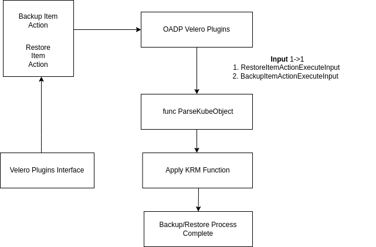
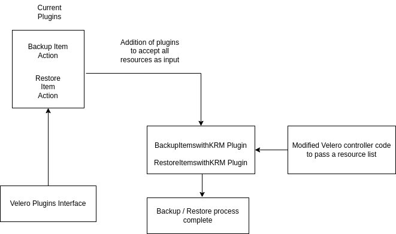

# TODO: Velero KRM Plugin Design

### Release Signoff Checklist

- [ ] Enhancement is `implementable`
- [ ] Design details are appropriately documented from clear requirements
- [ ] Test plan is defined
- [ ] User-facing documentation is created

### Open Questions
-  Can changes be made in exising codebase as opposed to refactoring the whole code?
-  Whether adding KRM (Kubernetes Resource Management) functions is actually useful for openshift velero plugins ?

### Summary
The enhancement proposes modification in current code by adding KRM functions support to prove that KRM functions can be used with openshift velero plugin. Further we plan to add plugins for Backup and Restore which will accept a list of resources and also modify the Velero controller code to pass in a list of resources to the new plugins rather than passing a single resource to improve the performance by reducing number of gRPC calls.

### Motivation

- To have a common set of KRM functions which are reusable.
- Currently velero plugin framework is inefficient. Velero server executes 1 gRPC call per plugin, meaning 1 gRPC call per resource transformation.  In order to overcome this we introduce a new plugin type that will allow Velero to leverage KRM functions for resource transformation and additional item gathering so that we can drastically improve the plugin framework performance by processing N items with a single gRPC call.

### Goals
- Check and research on if the given approach is feasible.
- Make changes to openshift velero plugins and introduce a new velero plugin type to which accepts a list of resources and uses KRM functions internally.
- Modify our velero fork to enable support for the new plugin type and enable processing of multiple items at a time.

### User Stories
- As a user of velero, I would like to re-use existing commuity-built KRM functions as velero plugins
- As a developer of velero plugins, I would like to increase the throughput of a plugin that handles a lot of resources, by getting them all at once.


## Design and Implementation Details

The idea is divided into 3 phases.

### Phase 1
This phase will be aimed towards making changes in current infrastructure so that parity can be achieved with BackupActionItemType and RestoreActionItemType and prove that we can use KRM functions with velero plugins. `ParseKubeObject()` can be used to convert the input from Velero Backup/Restore plugin in form of KubeObject and further operations can be performed on KubeObject. In this way we can assess if KRM functions work well with Velero Openshift Plugins.

The following snippet displays the structure of code if we make changes to existing codebase where input is a single resource.
```
func (p *RestorePlugin) Execute(input *velero.RestoreItemActionExecuteInput)
(*velero.RestoreItemActionExecuteOutput, error) {

	// KRM function logic to transform a particular resource
        // Convert input to KubeObject for resource transformation

}
```
### Phase 2


- Second Phase will be development of a new plugin type `BackupItemsWithKRM` and `RestoreItemsWithKRM` to the [velero plugins](https://github.com/vmware-tanzu/velero/tree/main/pkg/plugin/velero) that will allow a plugin author to take in a list of resources, execute KRM functions, and return a list of items with translated data to be included in the backup.


### Phase 3
After adding a new plugin to accept a list of resources,Third Phase will aim towards modifying the [Velero Controller](https://github.com/vmware-tanzu/velero/blob/main/pkg/backup/backup.go#L180)  to pass in to this plugin type a list of resources so that we achieve performance enhancement by reducing the amount of plugin calls.



***Example:***

Let us consider restoring N routes. In the current scenario we have to call the plugin N number of time for restoring routes. But if we modify the codebase and plugin interface to pass list of resources to plugin this will only require a single gRPC call thus drastically improving the performance.


### Drawbacks

The current solution has basic logic for implementation of plugins and replacing that with KRM functions will have three drawbacks

- Adding a new velero plugin type for KRM functions will require significant overhaul of the velero server framework. This is likely something that will take extensive upstream discussion with the Velero community.
- Rewriting the Velero controller code will take time and efforts.
- Processing items with KRM functions within the exisiting plugins actually makes performance worse and will need a new plugin type for long term success.
