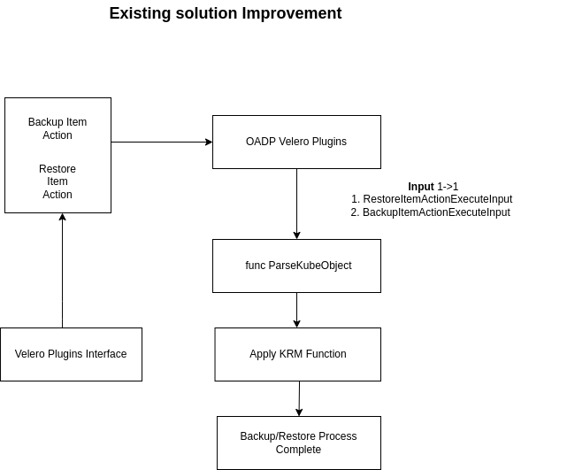
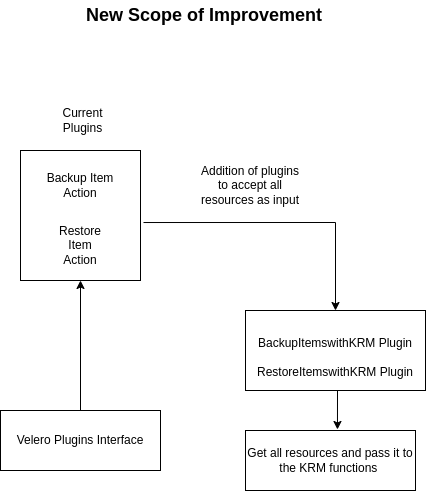

# Velero KRM Plugin Design

### Release Signoff Checklist

- [ ] Enhancement is `implementable`
- [ ] Design details are appropriately documented from clear requirements
- [ ] Test plan is defined
- [ ] User-facing documentation is created

### Open Questions 
-  Can changes be made in exiting codebase as opposed to refactoring the whole code? 
-  Whether adding in KRM functions is actually useful or will it affect the performance of current plugin in a negative manner?

### Summary

Currently Velero plugin framework is inefficient. It has to make on gRPC call to perform one resource transformation.  In order to overcome this we introduce a new plugin type that will allow Velero to leverage KRM functions for resource transformation and additional item gathering so that we can drastically improve the plugin framework performance by processing N items with a single gRPC call.

### Motivation

- To have a common set of KRM functions which are reusable.
- Improving the performance of Velero backup-restore process by only having one grpc call and passing a list of resources as opposed to having one grpc call to backup/restore a resource. 

### Goals
- Check and research on if the given approach is feasible.
- Make changes to OADP velero plugin and introduce a new plugin type to pass all resources and for  implementing KRM functions
- Modify the existing oadp controller code to pass all resource list to velero plugin backup/restore interface.

### User Stories 

- User will be able to pass all resource list in velero plugin interface as compared to the current one to one mapping of resources 

## Design and Implementation Details

The idea is divided into 2 phases.

 ### Phase 1 
It will consist of initially making changes in current Infrastructure so that parity can be achieved with BackupActionItemType and RestoreActionItemType and prove that we can use KRM functions with Velero Plugins.Futher Phase 1 is divided into two parts.
	 
 - First Part will consist of addition of KRM function logic in existing code where there is a  single resource being passed to the function. `ParseKubeObject()` can be used to covert the input from Valero Backup/Restore plugin in form of KubeObject and further operations can be performed on KubeObject. In this way we can assess if KRM functions work well with velero OADP Plugin.

- Second  Part will be development of a new plugin type `BackupItemsWithKRM` and `RestoreItemsWithKRM` that will allow a plugin author to take in a list of resources, execute KRM functions, and return a list of items with translated data to be included in the backup.

### Phase 2 
 Modify the velero controller codebase to pass in to this plugin type a list of resources so that we achieve performance enhancement by reducing the amount of plugin calls.

### Drawbacks

The current solution has basic logic for implementation of plugins and replacing that with KRM functions will have two drawbacks

- If we are not able to add an additional plugin and just change the code as it is it will add one extra layer of functions in the code which might be inefficient.
- Rewriting the OADP controller code will take time and efforts.
