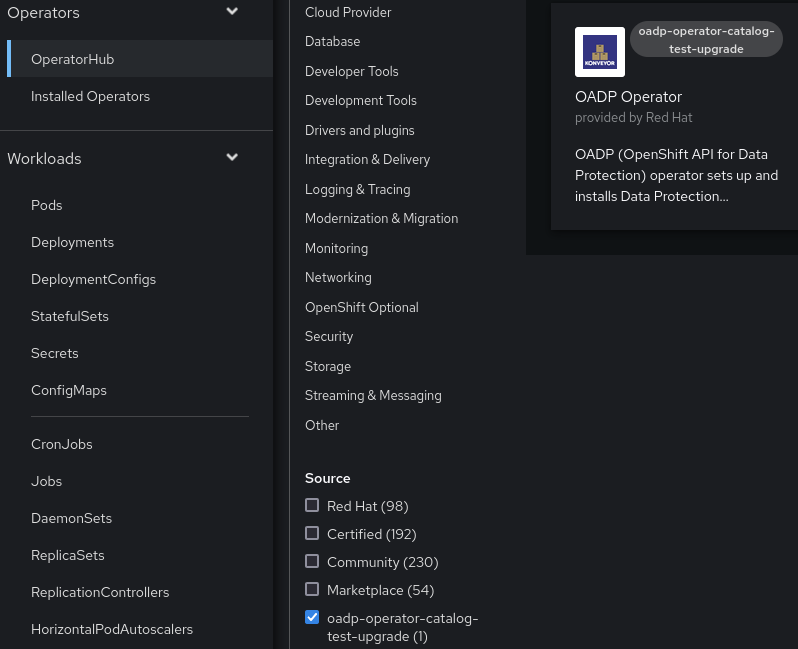
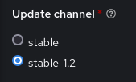
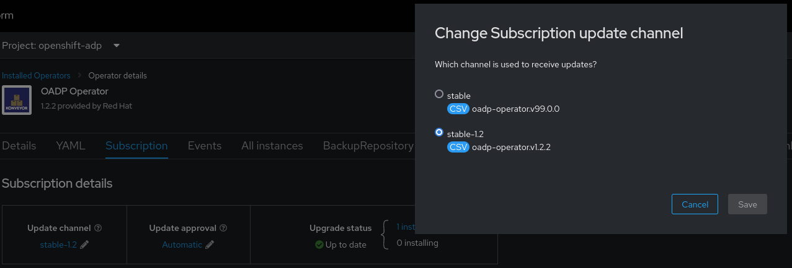

# Test OADP version upgrade

To test an upgrade from a version to another, run
```sh
make catalog-test-upgrade
```
from the branch you want to test the upgrade (master or a release branch).

This will create `oadp-operator-catalog-test-upgrade` catalog in your cluster (OperatorHub in the UI).



The catalog will have two channels:

- the previous version (the released version prior to the version of the branch you are)

    this is defined in `PREVIOUS_CHANNEL` variable in Makefile, and can be changed

- and the current version (the version of the branch you are, which can be yet unreleased, if on master branch)

> **Note:** to test production released versions, just install operator from marketplace, selecting the channel with previous version.

## Steps

### From UI

Select the new catalog in the UI and install selecting the previous version (for example, `stable 1.2`) update channel. This will install OADP operator from that branch (in the example, `oadp-1.2` branch).



Finally, after  creating a DPA, change channel of the installed operator to the next version (for example, `stable` - version 99.0.0, which points to master branch) in Subscription tab.



### From CLI

Check if a OperatorGroup already exists in namespace you will install OADP operator
```sh
oc get operatorgroup -n <oadp-namespace>
```
If not, create one with this content
```yaml
kind: OperatorGroup
apiVersion: operators.coreos.com/v1
metadata:
  name: oadp-operator-group
  namespace: <oadp-namespace>
spec:
  targetNamespaces:
    - <oadp-namespace>
```
For example, run
```sh
export OADP_NAMESPACE=openshift-adp
echo -e "kind: OperatorGroup\napiVersion: operators.coreos.com/v1\nmetadata:\n  name: oadp-operator-group\n  namespace: $OADP_NAMESPACE\nspec:\n  targetNamespaces:\n    - $OADP_NAMESPACE" | oc create -f -
```

Now create Subscription pointing to previous version (for example, `stable 1.2`) with this content
```yaml
kind: Subscription
apiVersion: operators.coreos.com/v1alpha1
metadata:
  name: oadp-operator
  namespace: <oadp-namespace>
spec:
  source: oadp-operator-catalog-test-upgrade
  sourceNamespace: openshift-marketplace
  name: oadp-operator
  channel: <previous-version>
  installPlanApproval: Automatic
```
For example, run
```sh
export OADP_NAMESPACE=openshift-adp
export PREVIOUS_CHANNEL=stable-1.2
echo -e "kind: Subscription\napiVersion: operators.coreos.com/v1alpha1\nmetadata:\n  name: oadp-operator\n  namespace: $OADP_NAMESPACE\nspec:\n  source: oadp-operator-catalog-test-upgrade\n  sourceNamespace: openshift-marketplace\n  name: oadp-operator\n  channel: $PREVIOUS_CHANNEL\n  installPlanApproval: Automatic" | oc create -f -
```

Finally, after  creating a DPA, change channel of the installed operator to the next version (for example, `stable`, which points to master branch)
```sh
oc patch subscription oadp-operator -n <oadp-namespace> --type='json' -p='[{"op": "replace", "path": "/spec/channel", "value":"stable"}]'
```

## Cleanup

To delete `oadp-operator-catalog-test-upgrade` catalog in your cluster after tests:
- uninstall operator and run `oc delete catalogsource oadp-operator-catalog-test-upgrade -n openshift-marketplace`
- or run `make undeploy-olm`

## Automated upgrade tests

Check [E2E Testing](./TESTING.md) documentation and [tests/e2e/upgrade_suite_test.go](../../../tests/e2e/upgrade_suite_test.go).
